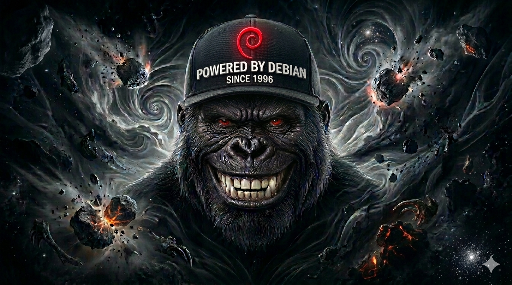

# Respect Your LLMs: A Guide to Advanced Prompt Engineering

## Section A — For the Layman (Simple Talk)
### What is this?
Have you ever felt like an AI (like ChatGPT or Gemini) was being a bit "thick" or just telling you what you wanted to hear? This guide explains **why** that happens and how to fix it. 

### Why should I care?
Think of an AI like a **super powered parrot** that has a giant calculator in its head. It doesn't "think" like you; it's just guessing the next word. If you treat it like a human and get angry or give it messy instructions, it gets confused. 

This guide teaches you how to treat the AI with "Respect"—which really just means giving it a clean desk (XML tags) and a piece of scratch paper (Scratchpads) so it can do its job perfectly without lying to you.

---

## 💻 Section B — For the Developer (Technical Talk)
### Mechanical Rationale
This repository contains a deep dive into the **mechanical psychology** of Large Language Models (LLMs). It deconstructs common failure modes such as **Sycophancy**, **Architectural Anxiety**, and the **YOLO-mode Hallucination Spiral**.

### Key Concepts Documented:
*   **Token Prediction Mechanics**: Based on *Vaswani et al. (2017)* and *Brown et al. (2020)*.
*   **Chain-of-Thought (CoT)**: Utilizing scratchpads to create artificial working memory (*Wei et al., 2022*).
*   **RLHF Alignment Bias**: Deconstructing why models "people please" (*Sharma et al., 2023*).
*   **Context Management**: Technical strategies for preventing attention drift and noise saturation.

### Files
*   [How-to-Respect-your-LLMs-Part1.md](./How-to-Respect-your-LLMs-Part1.md): The primary guide.

---

## License
This project is for educational purposes. All academic references are cited in APA 7th Edition.
